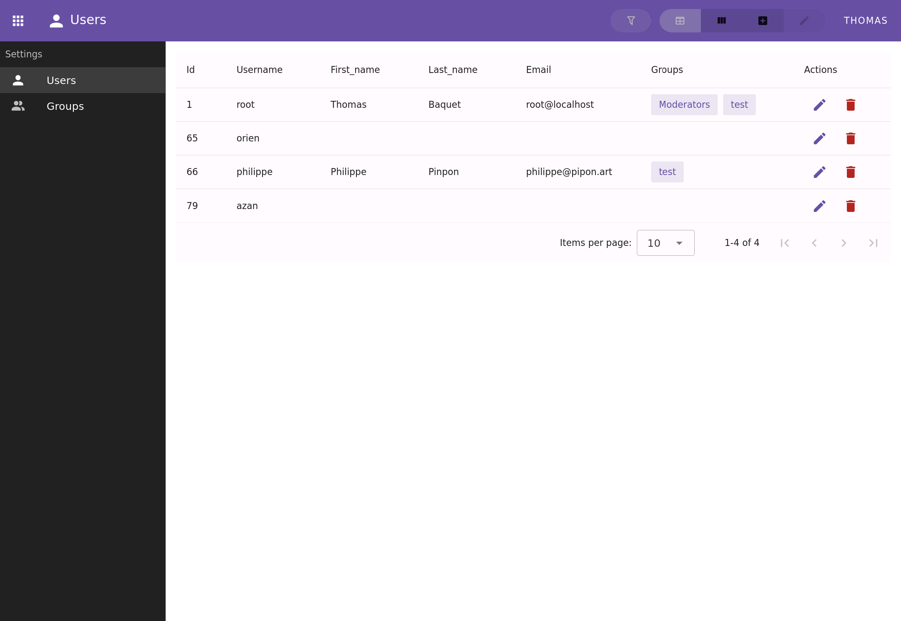

Oxylus
======

Oxylus is a modular, extensible platform designed to host a wide range of business applications — from contact and organization management to accounting, custom DevOps integrations, AI-enhanced workflows, and more.

The goal is to provide a solid, open-source foundation that supports both essential features and custom development, while encouraging collaboration, mutualization of development costs, and reuse of functionality across users and sectors.

The current project is in its early development steps. Don't expect it to be fully featured and free of bugs. We are at the step of setting up quality assurance on the proof of concept.

Why Oxylus?
-----------

We want to provide a tool that can be used as a base to develop full featured and modern applications. More than an ERP, it provides the foundations of an ecosystem that can be shared and used at lower cost than
traditional enteprise solutions (so called open-source ones included).

-️ Designed for extensibility: A core platform with reusable modules and clearly structured architecture for seamless integration of new apps.

- Open-Source by design: All code is licensed under an open license, enabling transparency, auditability, and community-driven improvement.

- Inclusive by intention: Accessibility is a priority, with ARIA standards already in use and full WCAG compliance planned.

- Shared development: Custom features developed for one client are made available to the entire user base, fostering a sustainable ecosystem and reducing duplicated effort.

- Built with proven tools: Leveraging the power and maturity of Django (backend) and Vue.js (frontend) to deliver robust, modern applications.

Features
--------

- Core framework backend and frontend;
- Datasets
- Frontend component library

Applications (and datasets when applicable):

- ``auth``: user, groups and permissions managements;
- ``locations``: country and related informations such as VAT/IBAN validation and examples; phone prefix; continent;
- ``contacts``: contacts and organisations management, entity types, related information (address, email, phone, bank account);
- ``content`` [WIP]: generic content edition and template framework to be used to render specific content (e.g. mails, invoices, etc.)
- ``mails`` [TBD]: manage mailing-list and subscription, using contacts and organisations;

Technically:

- Backend: Django, Django Rest Framework
- Frontend: Vue, Vuetify, Pinia, Pinia-ORM
- QA: pre-commit, unit tests
- Documentation

Practices and conventions
-------------------------
Here are conventions and practices we want for this project.

### Root principles
**Regardless who you are or define yourself, you have the right to be fully respected**, as we all are at first humans. It implies that pricks are not welcome here.

**Stick to PEPs and good development practices**. This including:

- pytest as much as possible;
- pre-commit code quality;
- CI/CD tests before merge;
- documentation must be provided, docstring and README provided. It should be succint but complete, including conventions, eventually code organisation, and usage;
- avoid to reinvent the wheel except when it is *really* necessary;
- avoid boilerplate, reuse code -- but don't over-generalize by using monolithic code: this induce technical debt as particular cases arise in usage and makes it hard to extend usage. In short: modularity is the way;

**KISS** is the way, remember it at each step of the conception and usage. Avoid to dive in the deep waters of hacky-dirty design and code -- you'll loose important parts of your life and health;

*Remember that code is easy to write, but is even more easy to get dirty. Good design and workflow are necessary as they avoid tons of problems. Providing projects is not a sprint, but a marathon -- a long harcheous journey between development, testing, quality assesment, production usage and debugging.*
