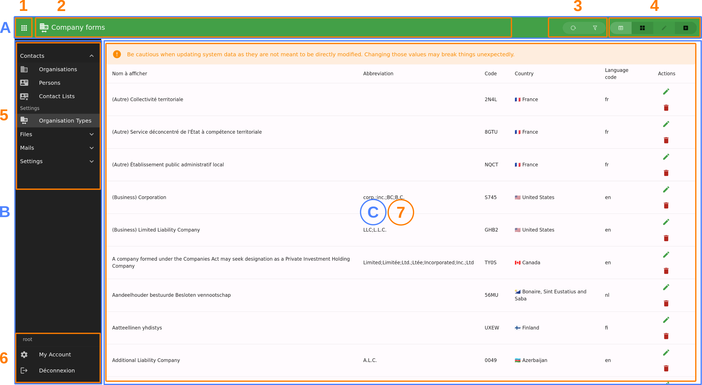

Client Application
==================

The client application is per Django app. This is in order to reduce load time and memory usage. It means that:

- You can't access from application A to B on UI point of view;
- You still can dynamically load what you need or bundle the other applications' components;
- What is loaded is only your bundled application's views and components;

Oxylus uses the following frameworks: Vue (composition API), Vuetify, Pinia, Pinia-ORM. A client application is a javascript/typescript Vite project.

The basic project structure looks like this (from the app folder):

.. code-block:: bash

    assets /
        package.json       # package information
        tsconfig.js
        vite.config.js     # vite project configuration
        src /              # source
            index.ts       # entry point: creates Vue application
            sfc.ts         # optional entry point: single file components
            models.ts      # pinia-orm models definition
            composables.ts # vue composables
            components /   # vue components
        tests /            # tests
        dist /             # bundles builts by vite
        node_modules /     # created when installing dependencies

The goal of the client application is to provide an interface to the end-user. This raises multiple requirements:

- user interface:

    - this is handled by Vue and Vuetify;
    - integrated into Oxylus framework: this is the ``@oxylus/ox`` libraries;

- manipulate objects from the backend:

    - modelize and handle data: using ``pinia-orm`` based models
    - synchronization with the server through API: (``@pinia-orm/axios`` in conjunction with ``rest_framework`` on the backend)

- quality: tests integration

The Oxylus layer makes this integration, and provides for the assets a set of components and composables.

.. note::

    Default configuration ensures that built files are put in ``dist`` directory.

    The Oxylus' static files finder looks up in this directory for the application's bundled files.
    Regarding dependencies declared by AppConfig's :py:attr:`~ox.core.apps.AppConfig.assets`, it looks up in the
    ``node_module`` folder.

Setup
-----

Configuration
.............

You'll need at least the ``@oxylus/ox`` npm package that provides all core elements to make it run. Some other: ``@oxylus/mails``, ``@oxylus/tasks``, etc.

Ensure to configure your ``package.json``, ``tsconfig.json`` and ``typedoc.json``.

Regarding, we already provide a  ``vite.config.js`` as template:

.. code-block:: javascript

    import baseConfig from '../ox/src/vite.config.base'

    export default baseConfig

For more customizations, use vite's ``mergeConfig`` method:

.. code-block:: javascript

    import { defineConfig, mergeConfig } from 'vite'
    import baseConfig from '../ox/src/vite.config.base'

    export default mergeConfig(
        baseConfig,
        defineConfig({
            build: {
                rollupOptions: {
                    input: {
                        // example: add an entry point for SFC.
                        // see How-to's section for more info about SFC
                        sfc: 'src/sfc.ts'
                    }
                }
            },
        })
    )

Entry point & App
.................

Default configuration uses ``src/index.ts`` as entry point of the application -- aka:
this is the module being loaded for initializing the application.

.. code-block:: typescript

        import {init, createPinia} from '@oxylus/ox'
        import {App as OxApp} from '@oxylus/ox/components'
        import * as components from './components'

        // Vue Application
        const App = {
            extends: OxApp,
            components,
        }

        // Initialize pinia
        const pinia = createPinia()
        init({App, plugins: [pinia] })

Few explanations about what's going on here:

- ``OxApp``: this is the default Vue application configuration;
- ``init``: initialize Vue, Vuetify and mount the app to default entrypoint.
  It also runs various setups as for translations.
- ``createPinia``: initialize Pinia-ORM with Oxylus specific customizations (such
  as include authentication models used for permissions, etc.)

Models
------

Models are stored in ``models.ts``. We use a custom version on pinia-orm's models.

Please refer to `Pinia ORM's documentation <https://pinia-orm.codedredd.de/>`_ for more info.

In ``assets/src/models.ts``:

.. code-block:: typescript

    import { models } from '@oxylus/ox'

    export class Book extends models.Model {
        static entity = "books"

        // The junction between Django and Vue/Pinia-ORM
        static meta = new models.Meta({
            app: "my_app",      // Django app name
            model: "book",      // Django model name (as in label)
            url: "my_app/book/",// API entry point to model's viewset
            title: "title"      // Specify a field or func to use as verbose_name
        })

        static fields() {
            id: this.attr(null),       // will be object's uuid
            author: this.string(""),   // uuid to related author
            title: this.string(""),
            summary: this.string(""),
            published: this.string(""),

            $author: this.belongsTo(Author, 'authors') // Related author's object
        }
    }

    export class Author extends models.Model {
        static entity = "authors"
        static meta = new models.Meta({
            app: "my_app",
            model: "book",
            url: "my_app/book/",
            title: (obj) => `${obj.first_name} ${obj.last_name}`
        })
        // ...
    }

Providing ``meta`` attributes allows the different utility classes to make the junction with Django, such as get API entry points.

You also need to add composable to allow usage of the models' repositories. In ``composables.ts``:

.. code-block:: typescript

    import {useModels, t} from '@oxylus/ox'
    import * as models from './models'

    /** Use our models. */
    export function useMyAppModels() : Object {
        return useModels([...models])
    }

    // You can also add field validation rules used by Vuetify here.

User Interface
--------------

Application Layout
...................

The client application provide the following layout using ``OxApp`` component. The screenshot is of a model panel (``OxOrganisationTypePanel``, the view is ``list.table``).

- **A**: top bar, providing quick access and navigation;
- **B**: applications menu (which can be hidden by button [1]);
- **C**: all panels displaying only the current one. A panel can provide multiple views [7];
- **1**: button to show/hide applications menu;
- **2**: panel or view's title and icon;
- **3**: view's actions;
- **4**: panel's views navigation buttons;
- **5**: applications navigation (reflect the structure provided by ``panels.py``);
- **6**: user menu;
- **7**: panel's content or views;

Panel and view title and navigations will be rendered in the top bar. A view can also provide extra actions and buttons there, such as showing
list filters. Note: filters are available for all list views, while the list itself is handled by the model panel component.

Panels can have a provided state which will be rendered when required (such as processing API request, or error display).

Panels
......

The client interface is composed of multiple panels, one per use-case or model. Panels are provided by applications and can be sub-divised into multiple views. The base component for panels is ``OxPanel``, which is extendable by its slots.
As an example, a common case is to provide CRUD for models, which is what does ``OxModelPanel``: it provides views for listing (with search and filtering facilities), edition and creation.

Panels and nested views are named, and accessible through their path. A panel has a default view falling back to ``list.tables`` when none is provided (it can be configured through component's attribute ``view``).

Here is a simple example of a panel:

.. code-block:: xml

    <ox-panel name="login" :title="Login" :icon="mdi-account">
        <template #append-title>
            <!-- this goes in the top bar at the right -->
        </template>
        <template #default>
            <!-- this goes in the main content -->
            <ox-login/>
        </template>
    </ox-panel>

Lets apply it to our own example. We will prefix our components with ``Ma``.

``components/MaBook.vue``:

.. code-block:: xml

    <template>
        <ox-model-panel v-bind="props" :repo="repos.files">
            <!-- forward slots provided by parent node -->
            <template v-for="name in forwardSlots" :key="name" #[name]="bind">
                <slot :name="name" v-bind="bind"/>
            </template>

            <!--
                [Optional] Put custom filters here.

                Filters are used for list rendering. They map to actual `django-filter`
                fields of a `filterset`.
            -->
            <template #list.filters="{list,filters, owner}">
                <slot name="list.filters" :list="list" :filters="filters"/>
                <!-- Example of input field, just remember to add `hide-details` -->
                <ox-field v-model="filters.year__eq" type="number"
                    label="t('fields.published')"
                    hide-details />
            </template>

            <!-- Override how an item's field will be rendered -->
            <template #item.author="{item}">
                {{ item.$author.first_name }} {{ item.$author.last_name }}
            </template>

            <!--
                You should provide an edit view which will be used for view/edit an item.

                `saved`: this method is called when the user saves the item;
                `value`: initial item's values.
            -->

            <template #views.detail.edit.default="{value, saved}">
                <ma-book-edit :initial="value" :saved="saved" />
            </template>
        </ox-model-panel>
    </template>
    <!-- We use typescript! -->
    

What does happens here?

- Property ``headers``: this list fields to be rendered by list views (table, card, etc.).
- Slots with name prefixed ``item.`` will be used to render fields by list views.
- Other slots will be nested under the ``OxModelPanel`` components, allowing for extensibility.
  You may want to filter some properly, for example ``list.filters``.
- The ``detail.edit`` view is provided for viewing/creating/updating a single item. In this view,
  you will provide the component used for edition (see next section).

.. note::
    Regarding user permissions, using the attributes provided by ``model.meta``, the different components will
    automatically check for user allowances. For example, if user has right to view but not edit an object,
    on the edit view, all items are rendered as non-editable fields.

Editor
......

As you might have seen, we also need to declare an `MaBookEdit` component. This one is used to render
the form for edition/view.

In `components/MaBookEdit.vue`:

.. code-block:: xml

    <template>
        <ox-model-edit ref="model-editor" v-bind="attrs" :repo="repos.books">
            <template #default="{editor}">
                <ox-field :editor="editor" name="title" required/>
                <ox-field :editor="editor" name="published" type="number" required/>
                <ox-field :editor="editor" name="summary" required/>

                <!-- Use autocompletion for the author -->
                <ox-autocomplete :repo="repos.author" lookup="search"
                    item-value="id" item-title="$title"
                    v-model="editor.value.author"/>
            </template>
        </ox-model-edit>
    </template>
    

Views
.....

A panel may contains multiple views. In such case, navigation buttons are displayed in the top bar. Views can provide actions shown next to it.

Views are put in a different slot each named as ``views.[name]``. The ``[name]`` will be used as view name (which is used in paths).

``OxModelPanel`` provides default set of actions based on this name, for thoses starting with ``list.`` and ``detail.``. Note that the prefix is included as view name, such as ``list.table`` for slot ``views.list.table``.

Path & Navigation
.................

The ``OxApp`` provide the ``panels`` object (``Panels`` controller), which is used to reset and assign a current value to panels among other things. You can use the method ``show()`` to change current panel.

.. code-block:: typescript

    panels = inject("panels") // get provided panels from component

    // view and value are optional
    panels.show({panel: "my_panel", view: "list.detail", value: "object-uuid"})

    // you should provide href when targetting a panel that is on another page
    panels.show({panel: "my_panel", href: "path_to_app"})

View names are usually composed of two parts joined by a dot: view type (``list``, ``detail``) and the actual name. Such as you'll have ``detail.edit``, ``list.table``, ``list.kanban``, etc.

Actions
-------

Actions are buttons that can execute a specific behaviour. It checks user's permission in order to execute, and can display in two different ways: as select list item, or as a button. This actually depends on the context: they are displayed in list views (usually as button, eg. in list view, a button a list row), and in detail view (in a select menu).

The ``OxAction`` component handles the following:

- User permission check (including object permission when required);
- Running an action, eventually asking user for confirmation;
- Can be used as link;
- Can be rendered as ``v-list-item`` or ``v-btn``;

There are different places where you might want to put action, so lets split it down in different use cases:

- Provide an action from the model panel component: directly add the action into the model panel's template for ``item.actions``;
- An external application want to provide the action to another app's model panel: in such case you'll extends and override the django template for model panel;

Extend Django model panel template
----------------------------------

The model panel declared in ``panels.py`` (:py:class:`ox.core.panels.Panel`) specifies
a :py:attr:`~ox.core.panels.Panel.template`, defaulting to ``ox/core/components/model_panel.html``.
This is the template to extend to add your custom action.

Lets just take a quick look at templates inclusion chart:

- ``ox/core/app.html``: includes ``model_panel.html`` for each panel declared in app's ``panels.py``;
- ``ox/core/components/model_panel.html``: uses provided ``panel`` (as :py:class:`ox.core.panels.Panel`) to render the actual panel. Includes the panel's ``action_template`` as:

    .. code-block:: jinja2

        <template #item.actions="bind">
            
            <ox-action-model-delete v-bind="bind"></ox-action-model-delete>
            
        </template>

By now you should know what to do for extending: override the template. Eventually,
you can use ``panel.name`` for conditional rendering (when extending default ``model_panel.html``).

Don't forget to provide ``bind`` to the action! This ensure the action will be correctly rendered and is used for the right item.

Monorepo setup
--------------

You may take example on the Oxylus' setup for this one. Few notes:

- Symbolic link from the package to the app's ``assets``, eg. ``ox/apps/contacts/assets => assets/packages/contacts``.
