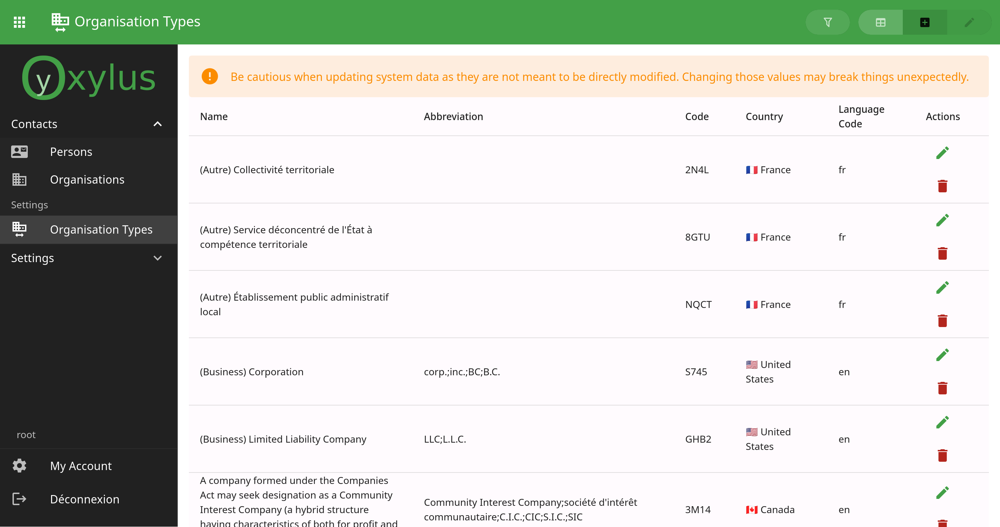
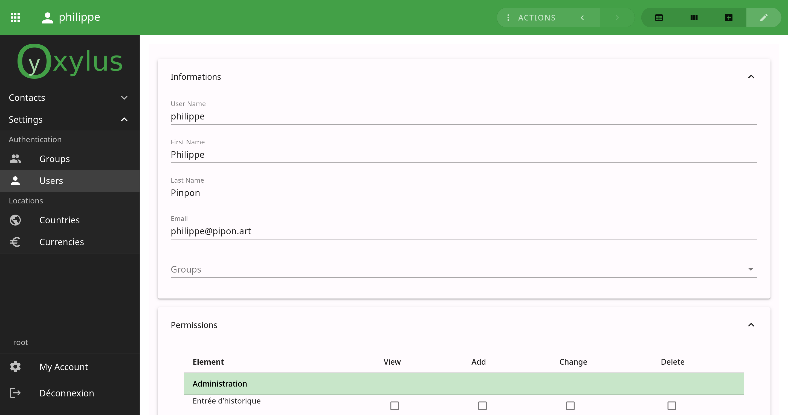

Oxylus
======

Oxylus is a web platform and framework focused on providing a back-office integrating the needs
of companies and institutions. It aims to offer a versatile platform that can be reused for custom
tools and development.

A lot of tools are domain specific (eg. blogging, eshop, administration, monitoring). Oxylus is a
home for all of them, and even more: anyone can reuse it.

It provides common toolz out-of-the-box, such as user management, user settings and contacts. Later
on the way, more will come.

Documentation
-------------

.. toctree::
   :maxdepth: 2

   guide
   api

Why do we need Oxylus?
----------------------

When it comes for enterprise to develop or use IT tools, they have multiple choices: using an already
existing solution (FLOSS, or proprietary licensed ones), or do things at home. This last choice
often leads to custom spaghetti code that costs a lot in term of development and technical debt.

Part of it is the lack of a framework that segregate the main layout and workflow to domain specific
ones. It also leads at the start of a project to reinvent the wheel, with a high probability of
refactoring what should have been trivial regarding the overall project.

This is where Oxylus enters into action. It provides a framework that integrate custom applications
into a single interface, while being domain agnostic. This means:

- Reduce the amount of work: no need to worry about creating a complete layout and fullstack integration.
- Exploit extensibility and reusability: we want to develop reusable applications, by sharing and mutualize
  efforts towards a digitalized world. Technology should be affordable to anyone: *lets do it*.
- Ensure quality product: by ensuring a quality we reduce costs due to bugs and lack of documentation.
  We want clear and complete documentation to anyone. We want quality. We provide a methodology over a
  product development workflow.

Project orientation
-------------------

There is a huge gap of comprehension between technical and non-technical users. The project here aims
to reduce this gap at its level: being comprehensive and accessible to both parts.

- Taking in account end-user experience;
- Document development process as well as the tools used;
- Provide a working methodology;
- Follow best practices and deliver quality product;

Technicaly speaking, we provide a stack relying on the power of well known and tested
existing frameworks. It integrates the power of Django (on the backend) with Vue's one
(on the frontend).

It allows integrating cutting edge technologies, notably in domain of AI while make it
accessible to small companies and groups of people.

Core Principles
---------------

Oxylus follows thoses principles:

**0. Follow good practices:**

Humanly: *respect people* .

Technically: analyze, methodology, testing. It takes time to make good engineering. Stay simple, don't try to do everything at once: it is better to have less but working features.

**1. Develop following modern web applications:** offer reactive and user experience oriented interfaces.

Technically speaking, use a web full stack using for backend the power of Django. Client-side take profit of the amazingness of Vue and related tools.

Each application systematically provided with:

    - Backend-side: application configuration, API (client), serializers, application view, other backend specifics;
    - Client side: Vue based Vite project, models, API (client);

We must enlight here some frontiers as they may be blur:

    - When a part of the interface requires some logic, behavior, widgets they must be encapsulated client-side.
    - In order to allow extensibility over templates rendering there still might be an equivalent as django's template.
    - Translation handling is kept under the respective owner of the text (backend or frontend).

Are we there yet?
-----------------

**Core**: core project and application framework.

[-] Client:

    - [-] Core:

        - [x] setup Vue application, including ORM on demand
        - [-] user authentication and permissions
            - [-] integrate into widgets and menus in order to know if it needs to render
            - [x] [backend] view integration
            - [-] [backend] login, logout
        - [x] [backend] HTTP errors reporting
        - [-] nav:
            - [ ] [P2] keep app level state among page reload (eg. application menu)
        - [ ] Settings:
            - [ ] [P1] User settings, integrate user account edition
            - [ ] [P2] Application settings
            - [ ] [P2] System settings

    - [ ] Applications integration:

        What does an application provides?

            - models: views, actions;
            - ui:
                - render content based on data providing ways to interact with it
                - widgets;
                - dynamic views
            - controllers:
                - backend interaction: API calls, model API calls;
                - user actions;

            - widgets:
                - user menu;
                - model: list, edit, fetch, action
            - link to other applications;

        - [ ] Concepts:

            A single application provide multiple views. They can be routed (present in navigation menu) or not (eg.
            server error page). They can be tabbed, and they actually are under the application tabs' windows.

            A panel has a title, icon, actions. It can be subdivised into multiple sub-panels (eg. edit object).

            An application ``provide`` the following objects:

            - ``repos``: pinia-orm repositories (as OxRepository or AxiosRepository);
            - ``models``: pinia-orm models
            - ``user`` (by ``OxApp.vue``): current user model instance;
            - ``app`` (by ``OxApp.vue``): application context, containing utils in order to work with application.

        - [ ] Integrate components from other applications;

            Django extensibility is not sufficient: the client-side must integrate external components.

            Vue's async components provide a way to load component on the fly. First experiments shows it seamlessly
            create required components as separate file output. But this only works on vite project's base. Treeshaker
            detects when an async import is made inside ``defineAsyncComponent``. Import is then resolved when code is execute.

            But what happens if application *A* integrates a component from application *B*. What happens to dependencies?
            *B*'s components are built using *B* configuration. Expectation would be the *B*'s component load its dependencies
            from *B* entries seamlessly.

            After some tests, we found a workflow for single file components generations: add a second entry to vite project ``sfc.js``
            importing the actual components; this creates SFC files too (this does not work when ``import()`` from ``index``). Component can then
            retrieved.

            Unfortunately, ``defineAsyncComponent`` is not only part of the job. This method expects we use the tag as declared, while we need display component directly from es module. In order to be able to do this, we use render functions.

            This method works simply and cleanly.

            - [x] SFC build workflow
            - [x] Base `OxComponent` loading components from server
            - [ ] properties, v-model, and slots forwarding

        - [-] Provide a mechanism to show a specific panel or widget:

            Using the basic application structure, allows to show a panel by id with related data.
            Allow to go back to previous panel without loosing data.

            It is implemented at ``App.vue`` level, using history in order to provide breadcrumbs in navigation.

            - [x] [P1] basic mechanisms: show a panel by id, providing data if required;
            - [x] [P1] show panel based on url parameter
            - [-] [P1] target panel on other pages
                - [ ] [P2] target panel with specific data id
            - [ ] [P2] confirm panel change when content is edited but not saved

    - [-] Action: set of predefined model's instance actions.

        Provide actions mechanism allows to reuse them among the different views, independent from model type nor
        the view while customizable on per-model/view basis.

        - [x] [P1] permissions handling
        - [-] predefined:
            - [x] [P1] Deletion (through actions)
            - [x] [P1] Edit from the same app, show any of its views;
            - [ ] [P1] Edit from other app

        Although actions are mechanism defined for a specific use, we might want to extend their principle into
        controllers, whose action is a derivative or a *widget*. May be usefull if we extend the view as a concept
        or in other use cases.

        The main idea behind actions is to allow behaviours to run at different places in applications. They
        keep coherency in terms of UX and avoid code duplication if well designed. It must be easy to add action,
        and they should remain consistent over multiple applications.

        Easyness is already provided by two mechanisms: 1 - Django template extensibility; 2 - Vue3 slots, injection and components. But is not sufficient.

        Consistent means that we must have action from one application to be runnable from the other. Awaiting we deep-dive into remote components loading, there already a solution to be provided. By using the power of Django and Vue's mechanisms, we can make actions widgets linked to a controler.

        The current implementation of the actions mechanism already provide basis for controller class. This is slight refactoring plus a few tasks:

        - [x] [P1] refactoring to create Controller class;
        - [x] [P1] provide `controllers` to be inject in `OxAction`.
        - [x] [P1] create OxAction and adapt OxActions;
        - [x] [P1] use action in django templates:
            - [x] [P1] adapt for extensibility on django side part.

        Controllers are independent from their representation (``Action``, etc.). They provide behaviors, distinct from composables as they
        are intended to be usable outside of Vue. It integrate logic of specific task(s) or use case such as API request handling.

        A single instance can be run over different input instances and types. This allows for example to use the same action among different models. Input is passed down as ``ControllerContext``, providing usefull informations.

        Action is then a widget, extensible on Django side. No more need to provide ``Model.meta.actions`` since templates are used for specialization and extensibility. Yeay!

        Some tactics of the strategy actually were seen somewhere else:

        - Use provide-inject: this allow to pass register of values (such as ``repos``, ``models``) which
          can be then used from inside components without having to pass extra properties. For example when a
          repository is to be used, we don't need to pass it down as property or whatsover. A component just will have
          to inject `repos` and use the one it wan't.

        - Widgets are parametrized in order to be reusable among models. Reusability use the same principle of good OO
          programming: keep it simple. Simple as not in "don't over-optimize".

          Complexity may result of the over-generalization syndrom, resulting into different things. Augment the code base
          of a method or an object, that becomes unreadable and hard to understand. Create too much elements by being too
          speficic to use cases. Deepling inter-dependants part of the code. This has been answered over different language
          by providing parametrization or derivation.

          A methodology to follow here is to be experience based. When a problem arises, take time to thing of a straight solution. Widget creation will get on the way, eventually through SFC.

        - Use Django templates in order to provide extensibility consistent accross applications. For example, the ``oxylus/core/app.html``
          use the block ``nav-list`` (main navigation menu) used to add applications' links.

          In case of action we may have:

            - ``oxylus/widgets/actions.html``:
                - block/props: container tag and attr => overriden by derived widget
                - block: container content => overriden by applications

            - ``oxylus/app/widgets/model_action.html``:
                - extend ``actions.html`` and override blocks

          What if we want buttons instead of a list? We create an itermediate model passed as props to ``model_action``,
          which is then used as parameter for ````. This is also a practice to provide reusable templates when rendering widgets (remember in such case to stay simple).

    - [-] Models:
        - [-] Edit one:

            For a provided model, an extensible interface in order to create or edit a model instance.

            - [x] [P1] Edition workflow, simple extensibility
            - [x] [P1] As widget into a panel: this is mostly how are sub-components of an EditPanel are structured to be usable.
            - [x] [P1] Actions
            - [-] [P1] Extends with components from other applications. Dependency: remote components
            - [ ] [P1] View related object action

        - [-] Lists:

            For a provided model, an extensible interface used to list model instances.

            This is not only for list views, but also as panel widget.

            - [x] [P1] List items, actions
            - [x] API integration:
                - [x] [P1] api action: provide a general mechanism to run API transactions
                - [x] [P1] data ownership
            - [ ] [P1] Batch actions
            - [ ] [P2] Toolbar: filters, reload, show-hide+default
            - [-] [P1] As widget into a panel

    - State and error management:

        Edition, API interaction and other workflow should provide a direct feedback of what is going on. This is
        done using ``State`` s, which allow to use reactive object and provide feedback over the current progress.

        However some feedback is specific to part of UI, eg. an error on a specific field. States can have associated
        ``data`` in order to provide extra information.

        - [x] [P1] State with data;
        - [x] [P1] Alert component based on state;

    - Core Components:

        - [x] [P1] Validation/Reset button
        - [-] [P1] Edit Panel
        - [-] [P1] API Data table

**Authentication**: provide basic user and group management application. Development of this application is used as POC.
- [-] Users & groups management:

    - [x] CRUD, permissions: views, API, components
    - [x] User: edit, assign to groups
    - [-] Group: edit, assign users
    - [ ] User own's account edition => User settings
    - [ ]

Ideas for later
---------------
Unordered section with ideas for later:

- Integrate user help into the interface: either taken from a manual or attributes on components;
- Generate client models based on provided Django serializer information:

    .. code-block::

        pinia.Model => BaseAppModel (generated) => AppModel
